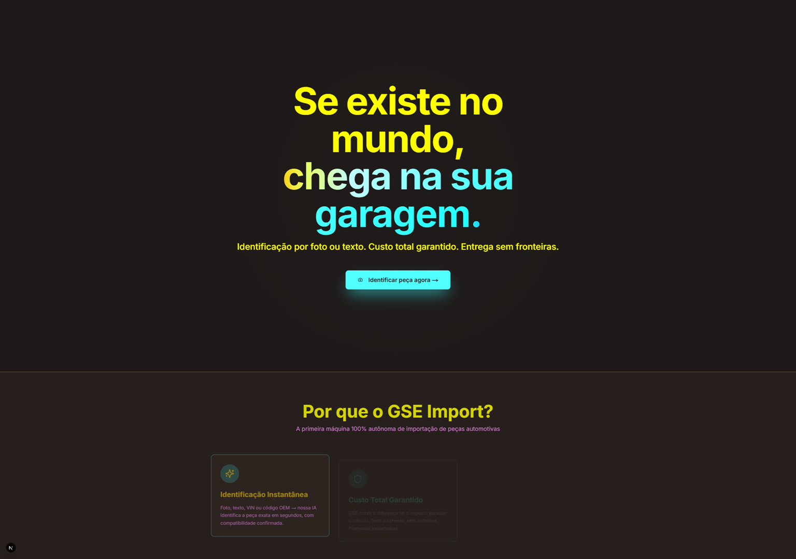

# GSE Import 🏎️🔥

**Global Sourcing Engine** — A primeira máquina 100% autônoma de importação de peças automotivas do Brasil.

> **"Se existe no mundo, chega na sua garagem."**

---
## 🎯 Visão
Resolver a angústia da "peça impossível" com **autonomia total**:
- Foto ou VIN → identificação instantânea por IA
- Busca global automática em múltiplos marketplaces
- Custo total garantido (GSE cobre diferença de taxação)
- Inspeção física + Vision AI automática
- Entrega sem surpresas, rastreio em tempo real

### Preview Atual (29/12/2025)

- Design System Borderless Premium aplicado na prática
- Fundo dark premium, hero imersiva, botão neon funcional, cards elevados
- Código Funcional | 30% (base frontend completa e visualmente confirmada)
- Próximo milestone: Scanner de Peças com upload e identificação por IA

**Promessa inquebrável:** Custo Total Garantido. Se o imposto exceder o cálculo, o GSE assume a diferença.

---
## 📊 Status Atual (27/01/2025)
| Pilar                  | Status      |
|------------------------|-------------|
| Visão & Documentação   | 100%        |
| Matriz Gênesis         | 100% (ativa)|
| Governança Técnica     | 100%        |
| Código Funcional       | 25% (base frontend rodando localmente) |

**A máquina tem alma. Agora ganha corpo.**

---
## 🛠 Stack Imutável
- **Frontend:** Next.js 15 + shadcn/ui + Tailwind
- **Backend:** Supabase + Drizzle ORM
- **Orquestração:** n8n
- **IA:** Provider-agnostic (OpenAI, Anthropic, Google, Grok)

---
## 🛡️ Governança (LEIA PRIMEIRO)
- [.cursorrules](.cursorrules) — Regras invioláveis
- [governance/MATRIZ_GENESE_GSE.md](governance/MATRIZ_GENESE_GSE.md) — 6 Leis Sagradas
- [governance/CLAUDE.md](governance/CLAUDE.md) — Checklist obrigatório
- [governance/AI_ABSTRACTION.md](governance/AI_ABSTRACTION.md) — Abstração de IA

---
**Exército de um homem só, multiplicado por IA.**  
**2026 é nosso.**

**Leonidas**  
**GSE Import - A Máquina que Roda Sozinha**
