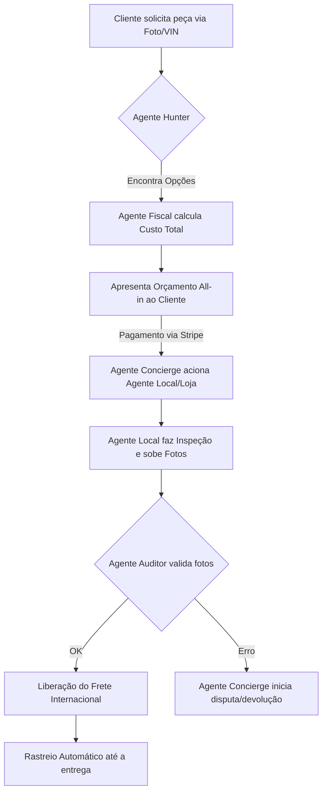

# Arquitetura de Agentes de IA GSE 1000/1000: Automação Total

Para ser 1000/1000, o GSE não pode depender de você para operar. A IA deve ser o seu "staff" virtual.

## 1. O "Staff" de Agentes de IA

| Agente | Responsabilidade | Gatilho (Trigger) |
| :--- | :--- | :--- |
| **Agente Hunter** | Varre a internet (eBay, Yahoo Auctions Japan, Taobao) em busca da peça exata solicitada. | Novo pedido ou solicitação de orçamento. |
| **Agente Fiscal** | Analisa a NCM, calcula impostos atuais e verifica se há restrições de importação. | Item selecionado no carrinho. |
| **Agente Concierge** | Responde dúvidas dos clientes, traduz mensagens para agentes na China e atualiza o status do pedido. | Mensagem no chat ou mudança de status no rastreio. |
| **Agente Auditor** | Analisa as fotos enviadas pelo agente de inspeção e compara com o catálogo original para garantir que é a peça certa. | Upload de fotos pelo agente local. |

## 2. Fluxo de Automação "Zero Touch"

## 3. Níveis de Segurança 1000/1000

1.  **Validação Biométrica:** Compradores e Agentes devem fazer check-in facial via IA antes de transações grandes.
2.  **Smart Escrow:** O dinheiro só sai da conta de garantia se o **Agente Auditor (IA)** e o **Cliente** derem o "OK" baseado nas evidências digitais.
3.  **Análise de Risco de Vendedor:** A IA analisa o histórico do vendedor no site de origem (ex: reputação no eBay) e bloqueia compras de vendedores suspeitos automaticamente.
